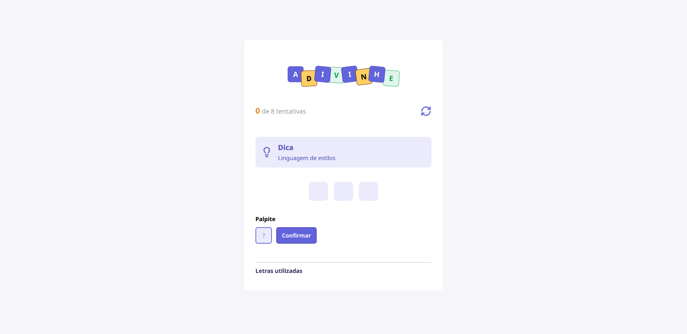

# 🎯 Adivinhe - Jogo da Palavra Misteriosa

Projeto desenvolvido em React + TypeScript onde o objetivo é adivinhar a palavra correta com base em uma dica e limite de tentativas. Uma forma divertida de treinar lógica e interação com o usuário.

## 📸 Demonstração

 

## 🧠 Sobre o Projeto

O usuário deve tentar adivinhar uma palavra com base em uma dica fornecida. A cada tentativa, ele insere uma letra e o sistema informa se ela está correta ou não. O jogador tem um número limitado de tentativas para descobrir toda a palavra.

### Funcionalidades

- ✅ Dica da palavra secreta
- ✅ Validação de letras repetidas
- ✅ Contador de tentativas
- ✅ Feedback visual para letras corretas e incorretas
- ✅ Reinício de jogo a qualquer momento
- ✅ Mensagens de sucesso ou falha

## ⚙️ Tecnologias Utilizadas

- [React](https://reactjs.org/)
- [TypeScript](https://www.typescriptlang.org/)
- CSS Modules – Para estilização

## 🚀 Como Executar

1. Clone o repositório:

```bash
git clone https://github.com/SeuUsuario/Adivinhe.git
